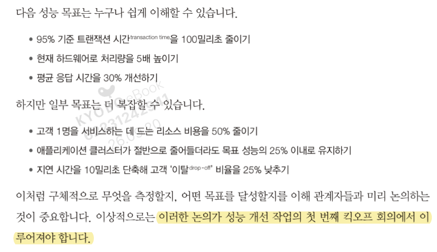
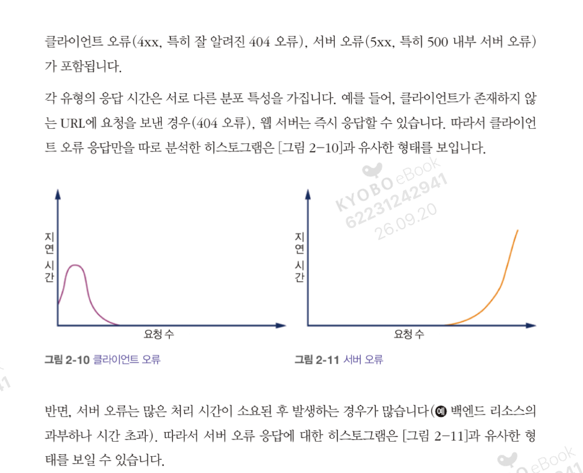

# 1주차 — Chapter 2. 성능 테스트 방법론

## 읽은 범위
Chapter 2

---

## 1. 성능 테스트 종류

| 종류 | 무엇을 묻는가 |
|---|---|
| 지연 테스트 | 요청 하나가 얼마나 걸리는가 |
| 처리량 테스트 | 단위 시간당 몇 건을 처리하는가 |
| 스트레스 테스트 | 여유 용량이 얼마나 남았는가 |
| 부하 테스트 | 예상 부하를 견디는가 |
| 내구성 테스트 | 오래 돌렸을 때 망가지는가 |
| 성능 저하 테스트 | 일부가 죽었을 때 어떻게 되는가 |

### 스트레스 테스트
- **정의** — 시스템의 여유 용량이 얼마나 있는지 확인
- **방법**
  1. 시스템을 일정한 트랜잭션 상태에 둔다
  2. 동시 트랜잭션 수를 천천히 올리며 성능이 저하되기 시작하는 지점을 찾는다

### 부하 테스트 — 실제 경험 (회사, k6)

staging lk-api 에 100 VU 로 3분.

**1. 전체를 먼저 재봤다**
실유저 여정을 비중대로 섞은 `mixed` 시나리오(목록 둘러보기 / 검색 / 더보기 / 리뷰)로 돌렸다.
결과는 실패 0%, p95 4초. **에러가 안 나니까 통과** 라고 읽으면 안 되는 케이스였다.
그리고 이 상태로는 어디가 느린지 모른다. 한 여정 안에 목록·검색·상세가 다 섞여 있어서다.

**2. 경로를 쪼개서 격리했다**
여정을 둘로 나눠 따로 돌렸다.
- `list` = 목록 진입만 (productList + categories)
- `detail` = 상세 진입만 (상세 fan-out 3~4콜)

여기서 결정적인 게 나왔다. **list 는 콜이 두 개뿐인데 DB CPU 가 96%** 였다. categories 는 레거시(rest) 쪽이니 lk-api 가 태우는 건 `productList` 하나. 범인이 특정됐다.
(detail 도 DB 91% 로 포화였지만 fan-out 이라 콜이 여러 개 섞여 원인 분리가 안 된다. 별도 과제로 남김)

**3. 왜 느린지 가설을 세우고 반증했다**
목록 API 가 느린 이유로 "뒷페이지일수록 OFFSET 이 깊어져 느리다" 를 의심했다. 확인하려고 같은 list 런을 파라미터만 바꿔 두 번 돌렸다.

| | p95 | DB CPU |
|---|---|---|
| page0 (첫 페이지) | 1.76s | 96.6% |
| page60 (720번째 상품부터) | 1.73s | 97.3% |

차이가 없었다. **OFFSET 은 원인이 아니었다.**
뒷페이지가 첫 페이지와 똑같이 느리다는 건, 페이지를 어디서 자르든 그 전에 하는 일이 동일하다는 뜻이다. 비용은 자르는 위치가 아니라 **자르기 전에 읽고 정렬하는 양** 에 있다.

**4. 원인은 앱 밖에 있었다**
pod CPU·JVM·커넥션은 전부 여유인데 DB CPU 만 천장. 그래서 쿼리를 EXPLAIN 떴다.

`COURSE` 테이블에 `CHANNEL_SEQ` 단일 인덱스만 있었다. 그래서 매 요청마다
- 채널 강좌 4,742행을 **전부 읽고** → 조건으로 825행을 걸러내고
- `ORDER BY (CHANNEL_ORD, COURSE_SEQ)` 를 맞추려고 **매번 filesort**

LIMIT 12 는 이게 다 끝난 뒤에 붙는다. 3단계에서 page0 ≈ page60 이 나온 이유가 여기서 설명된다.

해법은 복합 인덱스 하나. WHERE 등치 컬럼을 앞에, ORDER BY 컬럼을 뒤에 두면 인덱스가 필터와 정렬을 동시에 처리한다.
스케일아웃 · 커넥션풀 증설 · 커서 페이징은 전부 이 병목과 무관했다.

**배운 것**
- 증상 지점에서 바로 손대면 헛발질. HikariCP pending 184 를 보고 풀을 5→10 으로 올렸는데 아무 변화가 없었다. 쿼리가 느려서 커넥션 반납이 안 도는 거였다. 

### 내구성 테스트
짧은 테스트로는 안 잡히고, 오래 돌려야 드러나는 것들.

| 현상 | 내용 | 신호 |
|---|---|---|
| 느린 메모리 누수 | 요청당 몇 KB씩 해제 안 됨. 10분 테스트는 통과, 3일 뒤 OOM / Full GC 폭주 | GC 후 old gen 바닥선이 계속 우상향 |
| 캐시 오염 | 재사용 안 될 데이터가 캐시에 쌓여 hit rate 하락. 무제한 캐시면 힙까지 잠식 | hit rate 우하향 + 지연 우상향 |
| 메모리 단편화 | 빈 공간 총량은 충분한데 연속 블록이 없어 할당/승격 실패. G1 humongous object, CMS 같은 비압축 컬렉터에서 특히 | 힙 여유 있는데 Full GC 발생 |

### 성능 저하 테스트
- **정의** — 프로덕션 수준의 시뮬레이션 부하 중에 특정 구성 요소나 하위 시스템이 갑자기 용량을 잃을 때의 동작을 관찰
  - 예: 앱 서버 클러스터가 갑자기 멤버를 잃음, 네트워크 대역폭이 급락
- **관찰 항목** — 트랜잭션 지연 분포, 처리량
- **카오스 몽키** — 회복력 있는 아키텍처의 기준: 단일 구성 요소의 실패가 연쇄 실패를 유발하거나 시스템 전체에 유의미한 영향을 주면 안 된다

---

## 2. 모범 사례 개론

1. 중요한 요소가 무엇인지 파악하고, 측정하는 방법을 찾는다
2. 최적화하기 쉬운 것보다 **중요한** 것을 최적화한다
3. 가장 큰 영향을 미치는 요소부터 최적화한다

### 테스트 환경 생성
- 서드파티 네트워크 서비스는 목 서비스로 대체
- **불변 인프라 접근 방식**
  - 테스트 환경에 먼저 적용한 뒤 프로덕션에 반영하는 프로세스를 갖출 것
  - 테스트 환경에서 의도치 않은 프로덕션 의존성을 제거할 것
  - 테스트 환경에서도 실제 인증·권한 시스템을 적용하고 더미 구성 요소를 쓰지 말 것

### 성능 요구사항 식별

---

## 3. 성능 안티패턴의 원인

가장 와닿은 것: **5번 — 문제 자체를 제대로 파악하지 않은 상태에서 해결책이 먼저 제시되는 경우**

AI 와 맞물려 더 자주 발생한다고 느낌:
- 지라 티켓 초안대로 구현해달라고 하면 Claude 는 매우 잘 해준다
- 문제는 그 초안의 해결책이 최선이 아닐 수 있다는 것. 현 상황에 더 맞는 대안이 있을 수 있음
- 단순히 "해줘" 로만 던지면 이 지점을 통째로 놓친다

---

## 4. 자바 가상 머신 성능을 위한 통계

### 통계 해석 — 그림의 축 라벨 문제

이 그림들은 x축과 y축 라벨이 뒤바뀐 것으로 보인다. 실제로는 **가로축 = 지연 시간, 세로축 = 요청 수(빈도)**.

---

## 5. 인지적 편향과 성능 테스트

### 확증 편향
믿고 싶은 가설을 지지하는 데이터만 눈에 들어옴. 반증 데이터는 노이즈·측정 오류로 치부.
- 성능 판에서: "GC 가 범인이다" 정해놓고 GC 로그만 파다가 실제 원인(락 경합, N+1 쿼리)을 놓침. 튜닝 후 좋아진 지표 하나만 들고 "개선됨" 선언
- 방어: 가설을 **반증할** 측정을 미리 정해둠. 지표는 바꾸기 전에 고정. A/B 로 대조군 확보

### 혼란 속의 행동 편향
정보 부족·압박 상황에서 "뭐라도 해야 한다"는 충동. 가만히 관측하는 게 최선인데도 손을 댐.
- 성능 판에서: 장애 중 힙 크기·스레드풀·GC 플래그를 동시에 여러 개 변경 → 나아져도 뭐가 먹혔는지 모르고, 악화돼도 원인을 모름. 재현 불가한 상태만 남음
- 방어: 한 번에 하나만 변경. 변경 로그 남김. "관측만 하기" 도 유효한 행동으로 인정

### 위험 편향
변화의 위험은 과대평가, 현상 유지의 위험은 과소평가. 손실 회피의 일종.
- 성능 판에서: "건드리면 터진다" 며 명백히 문제 있는 설정·낡은 JVM 버전을 그대로 둠. 안 고쳤을 때 누적되는 비용(지연, 인프라 비용, 다음 장애)은 장부에 안 잡힘
- 방어: 안 바꾸는 쪽의 비용도 숫자로 적음. 롤백 경로를 먼저 만들어 변경 위험 자체를 낮춤

셋의 연결: 확증 편향이 틀린 가설을 살려두고 → 압박이 오면 행동 편향이 무작위 변경을 뿌리고 → 위험 편향이 정작 고쳐야 할 것을 막는다.

---

## 퀴즈 (Discussion 제출용)

**Q.** 
어떤 API 의 전체 응답 시간 히스토그램이 봉우리 여러 개인 다봉 분포로 나왔다. 평균과 p99 만 보고 튜닝하면 안 되는 이유를 설명하고, 어떻게 쪼개 봐야 하는지 서술하시오.

**A.**
다봉은 성격이 다른 여러 분포가 겹쳐 있다는 신호다. 404 같은 클라이언트 오류는 라우팅에서 즉시 반환돼 짧은 지연 구간에만 몰리고, 5xx 는 타임아웃이나 백엔드 과부하 끝에 나므로 긴 지연 구간에 몰린다. 성공 요청도 빠른 경로와 느린 경로가 따로 있을 수 있다. 이걸 합쳐서 평균을 내면 어느 하나도 설명하지 못하고, 빠른 404 가 많을수록 평균이 좋아 보이는 착시까지 생긴다. 응답 코드별·엔드포인트별로 분리해 각각의 분포를 봐야 한다.
---

## 사이드 프로젝트 적용 아이디어
