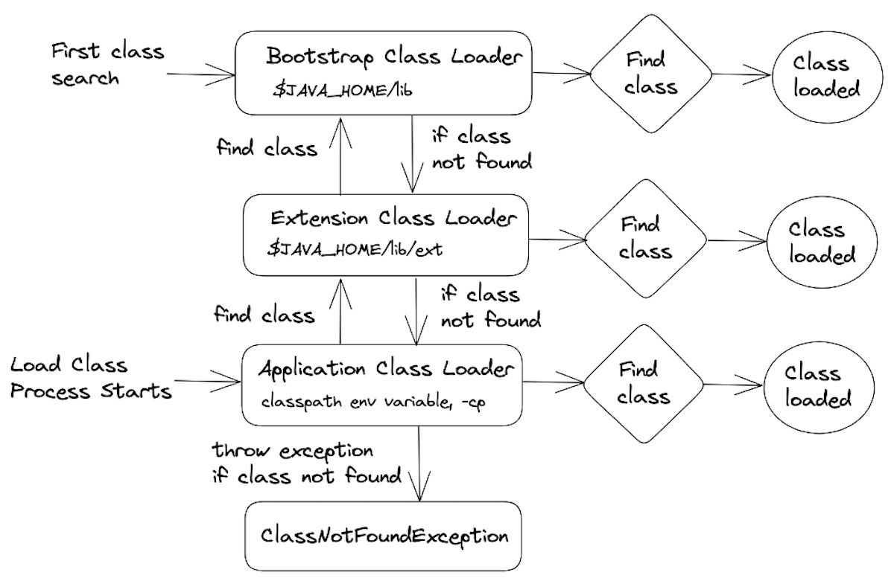
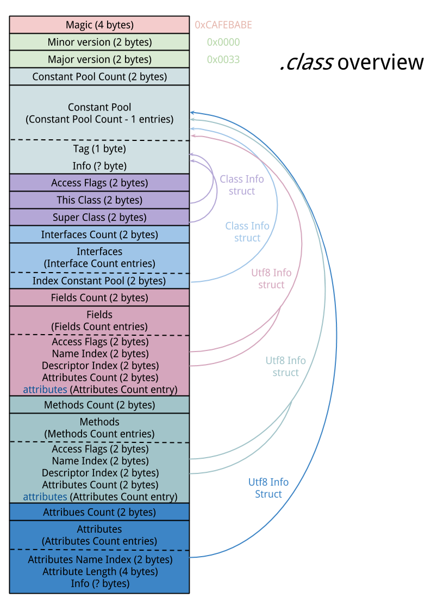

# 3. 자바 가상 머신 개요

자바는 가비지 컬렉션과 실행 최적화 같은 작업을 자바 가상 머신이 대신 처리하여 복잡성을 낮춰주는 이점이 있습니다..
덕분에 많은 개발자는 플랫폼의 저수준 세부 사항을 깊이 알지 않아도 개발할 수 있게 되었습니다.
하지만 성능에 관심이 있는 개발자라면 자바 가상 머신 기술 스택의 기본을 이해하는 것이 중요합니다.
이 장에서는 자바가 자바 가상 머신에서 실행되는 방식을 살펴봅니다.

## 3.1 인터프리팅과 클래스 로딩

### 인터프리팅
JVM은 스택 기반의 인터프리터 머신입니다.
CPU와 달리 계산 결과를 보관하는 레지스터가 없고 이를 평가 스택(operand stack)에 저장을 합니다.
JVM의 인터프리터는 스택을 사용해 중간 값들을 담아두고 가장 마지막에 실행된 명령어와 독립적으로 프로그램을 구성하는 명령코드(Opcode) 를 하나씩 순서대로 가져와서(pop) 처리합니다.

> [!TIP]
> JVM 인터프리터 기본 로직은 스택을 이용해 중간값들을 담아두고 opcode를 하나씩 순서대로 처리하는 while 루프 안의 switch문으로 이해해도 무방합니다!(물론 실제론 더 복잡하겠지만..)

### 클래스로딩(Classloading)

JVM은 OS 위에서 동작하고, 사용자가 작성한 클래스는 JVM이 실행합니다.
사용자가 작성한 클래스로 제어권(Control)을 넘기려면 EntryPoint가 필요한데, 
이때 자바에서의 EntryPoint는 클래스에 정의된 main() 클래스 메소드입니다.

이런 이유로 클래스를 로딩할 필요가 생겼고, 이때 관여하는 것이 클래스로딩 메커니즘입니다.
자바 프로세스가 초기화되면 연결된 클래스로더가 차례차례 동작합니다.

먼저 부트스트랩 클래스가 로딩되고 Java Runtime Core 클래스를 로딩합니다.
이떄는 최소한의 필수 클래스들만 로드합니다.

그 다음 확장 클래스로더가 생깁니다. 
확장 클래스로더가 하는 일은
- 특정 OS나 플랫폼의 네이티브 코드를 제공
- 기본 환경을 오버라이드(재정의)
입니다.

> [!TIP]
> 확장 클래스로더는 필요할 때 부트스트랩 클래스로더에 로딩 작업을 넘기기도 합니다 
> - 기본 데이터 타입 및 유틸리티: java.lang.Object, java.lang.String, java.util.List 등

마지막으로, 애플리케이션 클래스로더가 생기는데요,
클래스패스에 위치한 유저 클래스를 로드합니다.
자바 프로그램 실행 중 처음 보는 새 클래스를 디펜던시(Dependency) 에 로드하고,
이떄 클래스로더들이 찾지 못한 클래스들에 대해서 `ClassNotFoundException`이 발생합니다.

> [!TIP]
> 런타임 클래스는  풀 클래스 이름(Binary Name) + 클래스 로더(Defining ClassLoader) 조합으로 식별됩니다. 
> 클래스 이름과 바이트코드가 같아도 서로 다른 ClassLoader가 각각 정의했다면 서로 다른 타입입니다.
> 서로 다른 ClassLoader가 정의한 동일 이름의 클래스는 JVM에서 다른 타입으로 인식하기 때문에, 
> 한쪽에서 생성된 객체를 다른 쪽 클래스 타입으로 캐스팅(형변환)하면 `ClassCastException`이 발생할 수 있습니다.

## 3.2 바이트코드 실행

자바 코드는 javac에 의해 바이트코드로된 `.class` 파일로 생성됩니다.
이때, 최적화는 거의 하지 않기 때문에 그 결과로 생성된 바이트코드는 javap같은 표준 역어셈블리 툴로 쉽게 해독할 수 있습니다.
이렇게 생성된 바이트코드는 특정 컴퓨터 아키텍처에 특정하지 않은 중간 표현형(Intermediate Representation)으로,
컴퓨터 아키텍쳐의 지배를 받지 않아 JVM 지원 플랫폼 어디서건 실행할 수 있습니다.(이식성을 갖는 이유)

> [!TIP]
> 클래스 파일에는 포맷 버전이 있어서 JVM이 실행할 수 있는 클래스인지 올바른 형식을 준수하고 있는지 호환성 여부를 검사합니다.
> 이때 만약 버전이 호환이 안되면 `UnsupportedClassVersionError` 예외가 발생합니다.

## 3.3 핫스팟 소개

JVM은 언어 및 플랫폼 설계 과정에서 생산성과 퍼포먼스 간의 Trade-Off를 계속 고민해서 나온 결과물입니다.
편의성을 제공하면 부가적인 것을 함께 제공해서 오버헤드 발생했고,
성능을 선택하면, 고수준의 언어를 다루는 개발자가 저수준의 명령까지 기계에 일러 줘야해서 생산성이 덜어졌습니다.

C++은 제로-오버헤드 원칙을 준수하지만 Java는 그렇지 않았습니다.
중간 코드(Bytecode)를 생성하여 쓰기 때문에 이식성은 좋아지지만 제로-오버헤드는 아니게 되었습니다.
이러던 중, Java Hotspot JVM은 프로그램의 런타임 동작을 분석하고, 바이트 코드를  네이티브 코드로 컴파일해서 성능을 최적화하는 방식을 채택하게 되면서
성능을 C나 C++와 비교할 수 있는 수준까지 끌어 올리게 되었습니다.

## 3.4 JIT 컴파일

자바 프로그램은 실행 시 바이트코드 인터프리터에서 시작, 명령어는 가상화된 스택 머신에서 처리
핫스팟 가상 머신은 해석된 바이트코드를 네이티브 코드로 컴파일하여 성능을 향상시킴
네이티브 코드는 인터프리터를 거치지 않고 직접 실행(컴파일 단위 메서드, 루프)
-> 이 과정이 JIT 컴파일

성능향상을 위해 자주 사용되는 바이트코드를 네이티브 코드로 컴파일하는 방식입니다.
인터프리터 모드로 실행되는 동안 애플리케이션을 모니터링해서 자주 호출되는 코드를 발견해 JIT 컴파일을 수행합니다.
JIT 컴파일러는 실행되는 동안 수집한 정보로 최적화를 결정한다는 것이 가장 큰 장점입니다.
JIT 컴파일을 거친 코드는 처음 작성한 코드와 전혀 딴판일 가능성이 큽니다.(인라이닝 같은 기법을 사용하기 때문으로 추정)

### 간단 비교

| 구분 | AOT (Ahead-Of-Time) | JIT (Just-In-Time) |
|------|---------------------|--------------------|
| 컴파일 시점 | 실행 전 | 실행 중 |
| 이식성 | 떨어짐 | 좋음 |
| 워밍업 필요성 | 없음 | 있음 |
| 초기 구동 속도 | 빠름 | 느림 |
| 최적화 시점 | 한 번 | 실행 중 계속 |

> [!TIP]
> JIT 컴파일된 네이티브 코드는 Code Cache라는 메모리 영역에 저장되어 재사용됩니다.
> Code Cache 공간은 초기 실행 시 최대 값이 지정되며 런타임 중에는 더 이상 확장되지 않습니다.
> 지속적인 JIT 컴파일로 Code Cache 또는 특정 Code Heap의 공간이 부족해지면 새로운 JIT 컴파일이 제한될 수 있고, 
> 최적화되지 못한 메서드가 느리게 실행되면서 성능이 저하될 수 있습니다.
> `–XX:+PrintCodeCache`를 설정하면 확인 가능합니다

## 3.5 자바 가상 머신 메모리 관리

JVM은 가비지 컬렉션을 통해 자동으로 관리되는 힙 메모리 도입했습니다.
여타 다른 프로그래밍 언어(C, C++, Objective-C 등)들은 개발자가 직접 메모리 할당/해제를 수행합니다.
그만큼 개발자가 메모리를 정확하게 계산해서 처리해야하는 책임이 수반됐습니다.
하지만, 대부분의 개발자들이 메모리 관리 용어나 패턴을 모르는 경우가 많았고,
자바 초창기에도 메모리 관리를 부실하게 해서 애플리케이션이 에러가 나는 일이 매우 많았습니다.
자바는 GC(Garbage Collection)이라는 프로세스를 이용해 힙 메모리를 자동 관리하도록 설계했습니다.
다만, 객체가 언제 회수될지는 개발자가 정확하게 보장할 수 없기 때문에 GC의 회수 시점은 비결정적입니다.
그래서 Heap 사용량과 GC 횟수, Pause Time(STW) 같은 지표를 모니터링해서 GC가 애플리케이션 성능에 영향을 주고 있는지 확인해야 합니다.

## 3.6 스레딩과 자바 메모리 모델

자바는 멀티 스레딩으로 동작합니다.
메이저 JVM들은 애플리케이션에서 쓰는 스레드가 각각 OS의 전용 스레드로 대응되도록 구현되어 있습니다.
공유 스레드 풀을 사용해서 전체 애플리케이션 스레드를 사용하는 그린 스레딩이라는 기법도 있지만 성능이 나빠서 사용하지 않습니다.

자바 멀티 스레드 기본 설계 원칙
- 자바 프로세스의 모든 스레드는 가비지가 수집되는 하나의 공용 힙을 가진다.
- 한 스레드가 생성한 객체는 그 객체를 참조하는 다른 스레드가 액세스할 수 있다.
- 기본적으로 객체는 변경 가능하다. 즉, final로 불변(Immutable) 표시하지 않는 한 바뀔 수 있다.

## 3.7 가상 스래드 소개

자바 19부터는 가상 스레드(Virtual Thread)를 지원합니다.
가상 스레드는 OS 스케줄러가 아닌 자바 런타임이 스케줄링을 담당합니다.
가상 스레드는 OS 스레드보다 훨씬 가볍고, 수십만 개의 가상 스레드를 생성할 수 있습니다.
블로킹 I/O를 수행할 때 OS 스레드가 차단되지 않고, 가상 스레드가 차단됩니다.
이로 인해, 가상 스레드를 사용하면, I/O 대기 중심 서비스에서의 많은 수의 동시 연결을 처리할 수 있습니다.

  
  

> [!TIP]
> JDK 21에서는 synchronized 내부에서 Blocking I/O를 수행하거나 monitor 획득을 기다릴 때 Virtual Thread가 carrier에 pinning 됐습니다.
> JDK 24에 적용된 JEP 491부터는 다음 상황에서도 Virtual Thread가 carrier를 반납할 수 있습니다. 
> `synchronized 블록이나 메서드 내부의 Blocking -> monitor 획득 대기 -> Object.wait() 대기  -> monitor 재획득 대기`
> 따라서 Java 25에서는 Virtual Thread의 pinning을 피하기 위해 synchronized를 모두 ReentrantLock으로 변경할 필요가 없게 되었습니다.
> 다만 Native Method, Foreign Function과 일부 클래스 로딩 과정에서는 여전히 pinning이 발생할 수 있습니다. 
> pinning은 오류를 만들지는 않지만, 장시간 반복되면 carrier를 점유하여 처리량을 낮출 수 있습니다.
