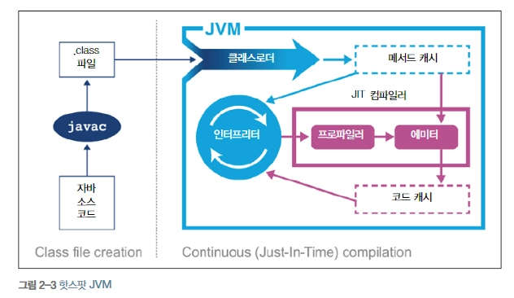

자바는 고수준의 설계를 바탕으로 개발자의 부담을 줄이는 것을 목표로 한다.

가비지 컬렉션과 실행 최적화 같은 작업을 자바 가상 머신이 대신 처리하여 복잡성을 낮춰 주는 것이 대표적인 예.

많은 개발자는 플랫폼의 저수준 세부 사항을 깊이 알지 않아도 개발할 수 있다. 그 결과, 내부적인 동작 방식은 성능 문제가 발생하여 고객이 이를 제기하는 등의 상황에서야 비로소 직면하는 경우가 많다.

## 3.1 인터프리팅과 클래스 로딩

- 자바 가상 머신은 스택 기반 인터프리터 머신이다.
    - CPU처럼 레지스터를 사용하는 대신, 연산의 중간 결과를 저장하는 실행 스택을 사용하며, 스택의 최상위 값을 기반으로 계산을 수행한다는 것을 의미
- 자바 가상 머신 인터프리터의 기본 동작을 while loop 안의 switch문으로 이해하면 된다.
    - 인터프리터는 프로그램의 각 연산 코드(opcode)를 이전 연산과 독립적으로 처리하며, 계산 결과와 중간 결과를 평가 스택에 저장한다.

애플리케이션을 `java HelloWorld` 명령어로 실행하면

운영 체제는 가상 머신 프로세스(자바 바이너리)를 시작한다.

자바 가상 환경이 설정되고, 사용자 코드가 포함된 `HelloWorld.class` 파일을 실제로 실행할 인터프리터로 초기화된다.

## 3.2 바이트코드 실행

자바 소스 코드는 실행되기 전에 여러 단계의 변환 과정을 거친다.

- 첫 번째 단계는 자바 컴파일러 `javac`를 사용하는 컴파일 과정
    - 이는 보통 더 큰 빌드 프로세스의 일부로 호출된다.
- `javac`의 역할은 자바 코드를 `.class`파일로 변환하여 바이트코드를 생성하는 것.
    - `javac`는 컴파일 과정에서 최적화를 거의 수행하지 않는다.
    - 그 결과, 생성된 바이트코드는 표준 `javap`과 같은 디스어셈블리 도구를 통해 확인할 경우, 여전히 자바 코드와 유사한 형태로 읽고 이해하기 쉽다.
- 바이트코드는 특정 머신 아키텍처에 종속되지 않은 중간 표현.
    - 하드웨어 아키텍처와 분리된 이식성을 제공, 이미 개발된 소프트웨어는 자바 가상 머신이 지원하는 모든 플랫폼에서 실행될 수 있다.

<aside>

자바 언어와 자바 가상 머신은 서로 독립적으로 발전했다. 자바 가상 머신은 유효한 클래스 파일을 생성할 수 있는 모든 언어를 실행할 수 있다.

실제로, 코틀린 컴파일러가 자바 가상 머신에서 실행할 바이트코드를 생성하는 과정을 보여주는 것으로 쉽게 대체할 수 있다.

</aside>

클래스 파일의 구성 요소

| 구성 요소 | 설명 |
| --- | --- |
| 매직 넘버 | 0xCAFEBABE(클래스 파일임을 나타내는 고유 식별자) |
| 버전 | 클래스 파일 형식의 마이너 버전 또는 메이저버전 |
| 상수 풀 | 클래스의 상수 풀(문자열, 숫자, 메서드, 클래스 등의 참조 포함) |
| 접근 제어 플래그 | 클래스가 추상적, 정적 등인지 나타내는 플래그 |
| 현재 클래스 | 현재 클래스의 이름 |
| 슈퍼 클래스 | 슈퍼 클래스의 이름 |
| 인터페이스 | 클래스가 구현하는 인터페이스 목록 |
| 필드 | 클래스에 정의된 필드(멤버 변수) 목록 |
| 메서드 | 클래스에 정의된 메서드 목록(바이트코드 포함) |
| 속성 | 클래스의 속성(소스 파일 이름 등) |

- 클래스 파일 구조를 위한 암기법
    - M: 매직
    - V: 버전
    - C: 상수
    - A: 접근제어
    - T: 현재 클래스
    - S:슈퍼 클래스
    - I: 인터페이스
    - F: 필드
    - M: 메서드
    - A: 속성

간단한 코드 예제를 통해 `javac`를 실행한 결과를 확인하고, 클래스 파일 구조의 각 요소가 어떻게 생성되는지 살펴볼 수 있다.

```java
public class HelloWorld {
		public static void main(String[] args) {
				for(int i = 0; i < 10; i++) {
						System.out.println("Hello World");
				}
		}
}
```

javap -c HelloWorld 명령어 실행하면 다음과 같은 출력이 나타난다.

```java
public class HelloWorld {
		public HelloWorld();
			Code:
					0: aload_0
					1: invokespecial #1 // Method java/lang/Object."<init>":()V
					4: return
					
		public static void main(java.lang.String[]);
			Code:
					0: iconst_0
					1: istore_1
					...
	}
```

이 레이아웃은 `HelloWorld.class`파일의 바이트코드를 설명한다.

이 클래스 파일에는 두 개의 메서드가 포함되어 있다.

- 소스 코드에서는 main() 메서드만 정의했지만, javac가 클래스에 기본 생성자를 자동으로 추가했기 때문에 생성자가 하나 더 포함되었다.

생성자에서 실행되는 명령어

1. aload_0, this 참조를 스택의 첫 번째 위치에 배치한다.
2. invokespecial, 부모 생성자를 호출하거나 객체 생성을 하는 특정 인스턴스 메서드를 실행할 때 사용된다.

이 기본 생성자는 Object 클래스의 기본 생성자를 호출하며, 사용자 정의 생성자가 제공되지 않기 때문에 자동으로 기존과 동일하게 추가된다.

main() 메서드로 넘어가면

- iconst_0
    - 정수 상수 0을 평가 스택에 푸시한다.
- istore_1
    - 이 값을 로컬 변수의 인덱스 1에 저장한다.

…

## 3.3 핫스팟 소개

1999년 4월, 썬 마이크로시스템즈는 자바 구현의 성능을 획기적으로 개선하는 변화를 도입했다. 핫스팟 가상 머신은 자바 성능을 C나 C++와 비교할 수 있는 수준까지 끌어 올렸다.




언어 또는 플랫폼 설계 두 가지 주요 접근 방식

- 제로-코스트 추상화
    - C++ 구현은 제로-오버헤드 원칙을 따른다.
      사용하지 않으면 비용이 들지 않는다.
    - 현실에서는 언어 사용자가 운영 체제와 컴퓨터의 저수준 동작 방식을 직접 다뤄야 한다는 부담(원시 성능이 최우선이 아닌 개발자에게는 상당한 인지적 부담을 준다)
- 개발자 생산성과 작업 완료를 더 중시하는 방식
    - 자바는 제로-오버헤드 추상화 철학을 따르지 않았다.
    - 핫스팟 가상 머신은 프로그램의 런타임 동작을 분석하여 성능을 극대화할 수 있는 부분에 최적화를 적용하는 방식을 선택.
        - 핫스팟 가상 머신의 목표는 개발자가 자바 언어의 관용적 사용을 따르고, 좋은 설계 원칙을 지키면서 성능을 최적화할 수 있도록 돕는 것

## 3.4 JIT 컴파일 소개

- 핫스팟 가상 머신은 해석된 바이트코드를 네이티브 코드로 컴파일하여 성능을 향상시킨다.
- 네이티브 코드는 인터프리터를 거치지 않고 직접 실행된다.
- 핫스팟 가상 머신의 컴파일 단위는 메서드와 루프이며 이 과정을
  JIT 컴파일이라 한다.

JIT 컴파일은 애플리케이션이 해석 모드에서 실행되는 동안 실행 빈도가 높은 코드 부분을 관찰하며 작동한다.

특정 메서드의 실행 빈도가 일정 임계값을 초과하면, 프로파일러가 해당 코드를 컴파일하고 최적호를 적용한다.

JIT 컴파일 접근 방식의 큰 장점 중 하나는 메서드가 해석되는 동안 수집된 실행 추적 정보를 기반으로 최적화 결정을 내릴 수 있다는 점이다. 이 정보를 활용하면 핫스팟 가상 머신이 컴파일 대상이 된 코드에 대해 보다 정밀한 최적화를 수행할 수 있다.

<aside>

일부 JIT 컴파일러는 실행 중 더 나은 최적화가 가능하다고 판단되면, 기존에 컴파일된 코드를 다시 컴파일 할 수 있다.

</aside>

<TIP> 자바 소스 코드가 바이트코드로 변환된 후, JIT 컴파일을 거치면서 실제로 실행되는 코드는 원래 작성된 소스 코드와 매우 다르게 변한다. 이는 중요한 사실로, 성능 문제를 조사할 때 어떤 접근 방식을 취해야 할지를 결정하는 핵심 요소가 된다. JIT 컴파일된 코드는 자바 가상 머신에서 실행될 때 원래의 자바 소스 코드와 전혀 다른 형태일 가능성이 높다.

- 자바처럼 프로파일 기반 최적화를 사용하는 환경은 런타임 정보를 활용할 수 있는 잠재력을 가진다. 이는 대부분의 AOT 플랫폼에서는 불가능한 방식이며, 동적 인라이닝이나 가상 호출 최적화 같은 성능 최적화를 적용하는 데 유리

제로-오버헤드 추상화를 포기한 접근 방식은, 특히 고성능 자바 애플리케이션을 개발할 때 주의해야 할 사항이 있다.

즉, 개발자가 ‘상식적인’ 추론이나 자바 애플리케이션의 실행 방식에 대한 지나치게 단순한 사고 모델을 기반으로 판단해서는 안된다.

<aside>

다시 말해, 자바 코드의 작은 부분을 분석하는 것은 전체 애플리케이션을 분석하는 것보다 훨씬 어렵다. 이는 매우 전문적인 작업으로, 대부분의 개발자가 섣불리 시도해서는 안된다.

</aside>

핫스팟의 컴파일 하위 시스템은 가상 머신이 제공하는 두 가지 기능 중 하나이다. 또 다른 핵심 기능은 자동 메모리 관리.

## 3.5 자바 가상 머신 메모리 관리

자바는 잘못된 메모리 관리나 이를 위한 시간 소모 문제를 해결하기 위해 `가비지 컬렉션`을 통해 자동으로 관리되는 힙(Heap) 메모리를 도입했다. 즉, 자바 가상 머신이 더 많은 메모리 할당이 필요할 때, 더 이상 필요하지 않은 메모리를 회수하고 재사용하는 비결정적 프로세스를 수행한다.

가비지 컬렉션에는 비용이 따른다. 전통적으로 가비지 컬렉션이 실행되면 애플리케이션이 멈추는 ‘정지된 세상’ 상태가 발생한다. 이 정지 시간은 매우 짧지만, 애플리케이션이 과부하 상태에 놓이면 길어질 수 있다.

### 3.6 스레딩과 자바 메모리 모델

자바가 처음 출시될 때 도입한 주요 혁신 중 하나는 멀티스레드 프로그래밍을 기본적으로 지원하는 것이었다. 자바 플랫폼은 개발자가 쉽게 실행 스레드를 생성할 수 있으며, 자바 8에서는 다음과 같이 작성할 수 있다.

```java
Thread t = new Thread(() -> (System.out.println("Hello World");});
t.start();
```

- 모든 프로덕션 자바 가상 머신은 멀티스레드 방식으로 동작한다.

자바의 애플리케이션 스레드와 운영 체제의 플랫폼 스레드는 과거에 차이가 있었다.

- 초기 자바에서는 애플리케이션 스레드가 플랫폼 스레드 풀에 매핑되거나 다중화되었다.
    - 이러한 접근 방식은 만족스러운 성능을 제공하지 못했고, 불필요한 복잡성을 초래
- 결국, 주류 자바 가상 머신 구현에서는 각 애플리케이션 스레드가 하나의 플랫폼 스레드에 정확히 대응하는 방식으로 변경되었다.

가상 스레드

- 애플리케이션 스레드 == 플랫폼 스레드로 전환 후
  애플리케이션은 대규모로 성장하고 확장되었다.
  애플리케이션이 생성하려는 스레드의 수 또한 크게 증가하였다.
  그 과정에서 스레드 병목 문제가 발생했다.
- 자바 21 이상에서만 사용할 수 있다
- 네트워크 I/O와 같이 많은 동시 실행 컨텍스트를 필요로 하는 작업에서 강력한 성능
- 프로그래머는 스레드를 명시적으로 가상 스레드로 생성하도록 선택해야 한다.
  그렇지 않으면 플랫폼 스레드로 생성되며 기존과 동일한 동작을 유지한다.

<aside>

자바 21 이전의 모든 스레드(플랫폼 스레드)는 Thread 객체의 start() 메서드가 호출될 때 생성되는 고유한 운영체제(OS) 스레드로 지원된다고 간주해도 안전하다.

</aside>

멀티스레드 프로그램에서 데이터를 다루는 자바의 접근 방식

다음과 같은 기본 설계 원칙을 따른다.

- 자바 프로세스의 모든 스레드는 하나의 공통적인 가비지 컬렉션 힙을 공유한다.
- 하나의 스레드에서 생성된 객체는 해당 객체에 대한 참조를 가진 다른 스레드에서 접근할 수 있다.
- 객체는 기본적으로 변경 가능하다. 즉, 객체 필드에 저장된 값은 프로그래머가 명시적으로 final 키워드를 사용해 불변임을 표시하지 않는 한 변경될 수 있다.

## 3.7 자바 가상 머신 모니터링 또는 도구

자바 가상 머신 애플리케이션을 위한 주요 도구

- 자바 관리 확장 프로그램(JMX)
- 자바 에이전트
- 자바 가상 머신 도구 인터페이스(JVMTI)
- 서비스 지원 에이전트(SA)

자바 관리 확장 프로그램은 자바 가상 머신과 그 위에서 실행되는 애플리케이션을 제어하고 모니터링하기 위한 범용 기술.

그와 관련된 네트워크 전송 기술인 원격 메서드 호출(RMI)은 자바 가상 머신 관리 기능의 근본적인 요소이다.

자바 에이전트는 java.lang.instrument 인터페이스를 활용하여, 클래스가 로드될 때 메서드의 바이트코드를 수정할 수 있도록 지원하는 도구 구성 요소.

자바 계측 API가 충분하지 않은 경우, 자바 가상 머신 도구 인터페이스를 대신 사용할 수 있다.

서비스 지원 에이전트는 자바 객체와 핫스팟 데이터 구조를 모두 노출할 수 있는 API와 도구의 집합

## 3.8 자바 구현, 배포 또는 릴리스

### 3.8.1 배포본 선택

자바 배포본 선택은 개발자와 아키텍트에게 매우 중요한 결정.

일반적으로 조직이 자바 가상 머신 배포본을 선택할 때 중요하게 여기는 주요 요소

- 프로덕션에서 사용하려면 비용을 지불해야 하는가?
- 발견한 버그를 어떻게 수정할 수 있는가?
- 보안 패치를 어떻게 받을 수 있는가?

오라클

이클립스 어답티움

레드햇

아마존 코레토

마이크로소프트 OpenJDK

애저 시스템

그랄VM

OpenJ9

안드로이드

### 3.8.2 자바 릴리스 주기

새로운 기능 개발은 깃허브의 여러 저장소에서 공개적으로 이루어진다.

자바의 새로운 릴리스는 6개월마다 메인 브랜치의 최신 내용을 기반으로 생성된다.

보안 패치를 받고, 보안 문제 수정의 가능성이 있는 무료 자바 배포본을 원한다면, OpenJDK 벤더 중 하나를 선택하고 오라클의 장기 지원(LTS) 버전을 사용하는 것이 가장 좋다.