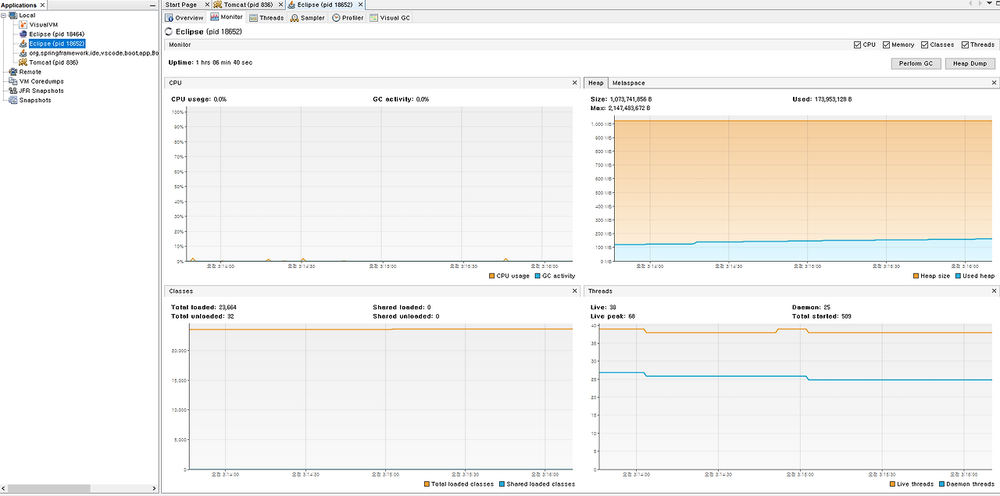
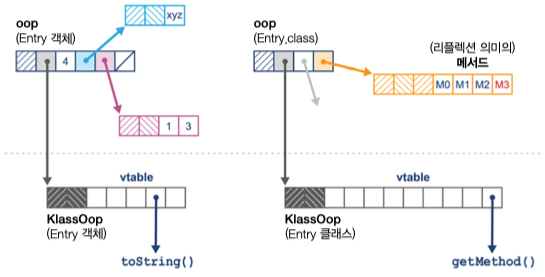
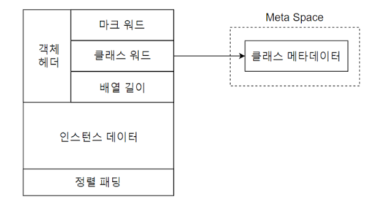
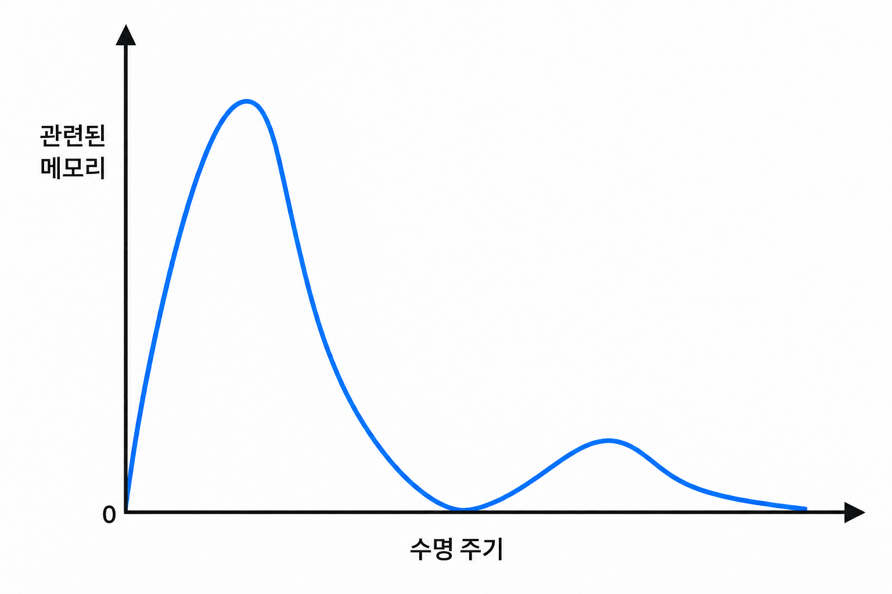
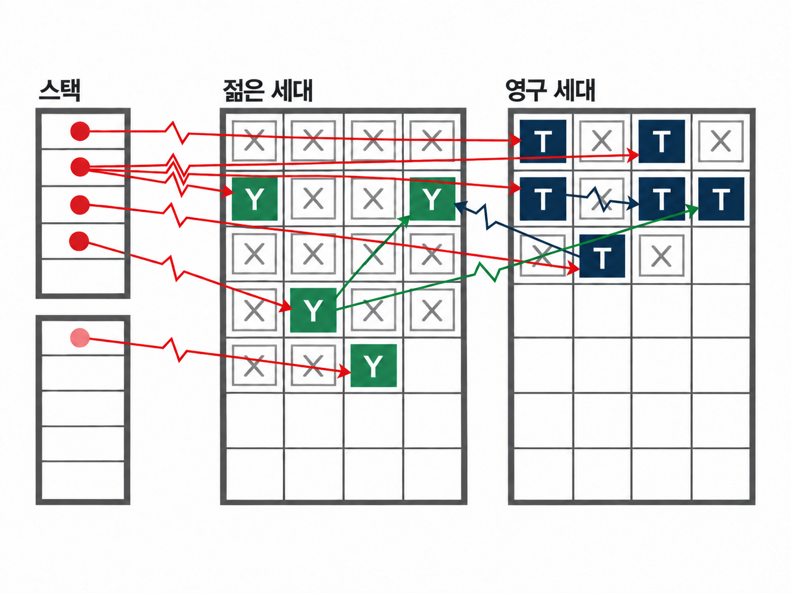
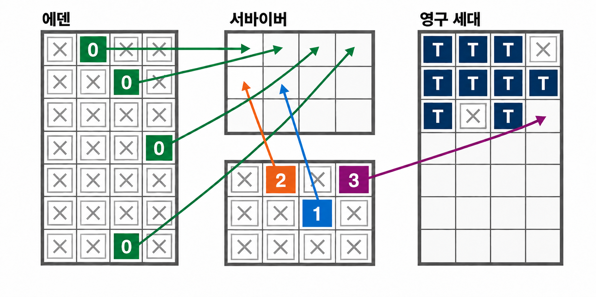
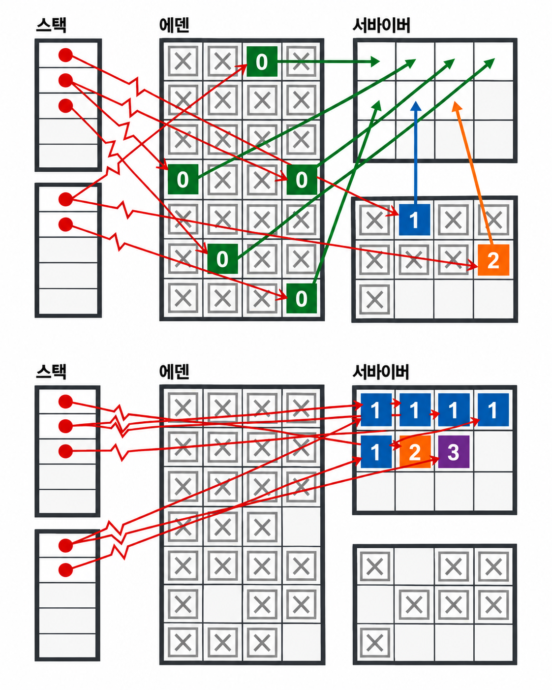

# 4. 가비지 컬렉션 이해하기

자바의 가비지 컬렉션의 핵심은 수명 주기를 런타임이 관리한다는 점입니다.
더 이상 필요하지 않은 객체를 자동으로 제거하며, 이렇게 회수된 메모리를 초기화된 후 재사용할 수 있습니다.

가비지 컬렉션 구현은 다음 구 자기 규칙을 준수합니다.
- 활성 객체는 절대 수집되지 않아야 합니다.
- 알고리즘은 모든 가비지를 수집해야 합니다.

이 중에서도 첫 번째 규칙이 중요합니다.
활성 객체를 수집하려면 세그멘테이션 오류(segmentation fault)가 발생하거나,
프로그램 데이터가 조용히 손상(silent corruption)될 수 있습니다.
가비지 컬렉션 알고리즘이 일부 가비지를 지속적으로 수집하지 못한다면,
최악의 경우 시간이 지나면서 메모리를 모두 소진하여 `OutOfMemoryError`가 발생할 수 있습니다.
이는 심각한 문제지만, 활성 객체를 잘못 수집하여 메모리 손상을 유발하는 것보단는 상대적으로 나은 상황에 속합니다.

> [!TIP]
> 세그멘테이션 오류는 프로그램이 허용되지 않은 메모리 영역에 접근을 시도하거나, 허용되지 않은 방법으로 메모리 영역에 접근을 시도할 경우 발생합니다.
> 운영체제의 메모리 보호 기능이 이를 감지하면 보통 해당 프로세스를 강제 종료합니다.

두 번째 규칙은 다음과 같은 가비지 컬렉션 알고리즘 방식처럼 비교적 유연하게 적용될 수 있습니다. 
- 오래된 객체를 힙에 오랫동안 남겨두고, 전체 가비지 컬렉션 사이클이 실행될 때까지 이를 수집하지 않는 방식
- 특정 메모리 영역에 가비지가 충분히 쌓이지 않았다면 해당 영역을 수집하지 않는 방식

## 마크 앤 스윕
가비지 컬렉션은 마크 앤 스윕 알고리즘을 기반합니다.
마크 앤 스윕 알고리즘은 할당된 객체 리스트를 사용하여,
회수되지 않은 객체들의 포인터를 유지하는 방식으로 동작합니다.
이 과정은 다음과 같이 정리할 수 있습니다.
1. 할당된 리스트를 순회하며 마크 비트(mark bit)를 초기화합니다.
2. 힙으로의 모든 포인터를 시작점으로 하여 접근 가능한 모든 객체를 찾습니다.
3. 도달한 각 객체에 마크 비트를 설정합니다.
4. 할당된 리스트를 순회하며, 마크 비트가 설정되지 않은 객체에 대해 다음 작업을 수행합니다.
  - 힙에서 해당 객체의 메모리를 회수하여 자유 리스트(free list)에 다시 추가합니다.
  - 객체를 할당된 리스트에서 제거합니다.

활성 객체는 보통 깊이 우선 탐색(DFS, Depth First Search)으로 탐색되며,
이렇게 만들어진 객체의 그래프를 활성 그래프(live object graph)라고 합니다.
이는 접근 가능한 객체의 추이적 폐쇄(transitive closure of reachable objects)라고도 부릅니다.
반대로, 접근할 수 없는 객체는 죽은 객체라고 합니다. 

> [!TIP]
> 힙의 상태를 시각화하는 도구 들 중 하나인 `visualvm`을 사용하면, 힙에 할당된 객체의 수와 메모리 사용량을 확인할 수 있습니다.
> 

## 가비지 컬렉션 용어

### STW
STW는 Stop The World의 약자로, 가비지 컬렉션 사이클이 진행되는 동안 모든 애플리케이션 스레드를 멈춰야 합니다.
이를 통해 애플리케이션 코드가 가비지 컬렉션 스레드가 보는 힙 상태를 무효화하지 않도록 보장합니다.
일반적으로 이 방식을 사용합니다.

### 동시성
가비지 컬렉션 스레드가 애플리케이션 스레드가 실행되는 동안에도 동작할 수 있습니다.
이러한 방식은 계산 자원을 더 많이 소모됩니다.
핫스팟의 기본 가비지 컬렉터는 G1(garbage first)이며, G1은 일부 동시성 측면을 가지고 있습니다.

> [!TIP]
> 동시성이라는 용어는 슬라이딩 스케일(sliding scale) 개념으로 이해하는 것이 좋습니다.

### 병렬
가비지 컬렉션 작업을 여러 스레드와 여러 코어를 사용해 실행합니다.

### 보수성
GC에서 보수성(conservative) 이란, 어떤 값이 포인터인지 확실히 알 수 없을 때도 
“포인터일 가능성이 있다면 포인터로 취급해” 객체를 살아 있다고 판단하는 방식입니다.
이 방식은 실제 사용 중인 객체를 실수로 회수하는 위험은 줄이지만, 단순 정수값 등을 포인터로 오인해 이미 쓰이지 않는 객체를 회수하지 못할 수 있습니다.
즉, 메모리를 잘못 해제하는 것보다 불필요한 메모리를 남기는 쪽을 선택하는 안전 우선의 근사 방식이며, 
그 결과로 메모리 낭비나 단편화가 발생할 수 있습니다.

### 이동
이동형 컬렉터에서는 객체가 메모리 내에서 재배치될 수 있습니다.
즉, 객체가 고정된 주소를 갖지 않음을 의미하고, 
자바와 달리 원시 포인터를 직접 다룰 수 있는 환경에서는 이동형 컬렉터를 적용하기 어렵습니다.

### 압축 
가비지 컬렉션 사이클이 끝날 때, 할당된 메모리(생존 객체)는 단일 연속 영역(보통 해당 영역의 시작 부분)에 배치되고,
새로운 객체를 기록할 수 있는 빈 공간의 시작 지점을 가리키는 포인터가 존재합니다.
압축 컬렉터는 메모리 단편화를 방지합니다.

> [!NOTE]
> GC의 압축(compaction)은 가비지 객체를 제거한 뒤, 살아남은 객체들을 힙의 한쪽으로 옮겨 연속적으로 붙이는 작업입니다. 
> 이때 객체의 위치가 바뀌므로 GC는 객체를 가리키던 모든 참조도 새 주소로 갱신해야 합니다.
> 그 결과 빈 메모리가 하나의 큰 연속 공간으로 합쳐져, 작은 빈 공간들이 흩어지는 메모리 단편화를 막고 큰 객체도 더 쉽게 할당할 수 있습니다.
> 새 객체는 빈 영역의 시작을 가리키는 할당 포인터를 앞으로 이동시키는 방식으로 빠르게 배치할 수 있지만, 
> 객체 이동과 참조 갱신 자체에는 GC 작업 비용이 듭니다.

### 대피
가비지 컬렉션 사이클이 끝날 때, 수집된 영역은 완전히 비워지고, 
모든 활성 객체가 다른 메모리 영역으로 이동(대피)됩니다.
우수한 대피형 컬렉터는 메모리 단편화를 방지합니다.

> [!NOTE]
> GC의 대피(evacuation) 는 수집 대상으로 선택된 메모리 영역에서 살아 있는 객체만 다른 비어 있는 영역으로 복사해 옮기는 방식입니다. 
> 객체가 이동하면 기존 객체를 가리키던 참조도 새 주소를 가리키도록 갱신합니다.
> 대피가 끝나면 원본 영역에는 생존 객체가 남지 않으므로 영역 전체를 통째로 빈 공간으로 반환해 이후 객체 할당에 재사용할 수 있습니다.
> 생존 객체를 새 영역에 모으는 과정 자체가 압축 효과를 내므로 단편화를 줄입니다. 
> 예를 들어 G1은 가비지가 많은 Region을 우선 선택해 대피하며, 이를 통해 회수 효율과 목표 일시 정지 시간을 함께 관리합니다.

## 핫스팟 런타임 소개
자바 가상 머신에서 가비지 컬렉션이 어떻게 작동하는지 이해하려면 핫스팟 내부의 세부적인 동작 방식까지 파악할 필요가 있습니다.
자바에는 기본 타입(primitive type)과 참조 타입(reference type) 이 두 가지 종류의 값만 있다는 점을 기억해야 합니다.

자바는 일반적인 주소 역참조(dereference) 매커니즘을 제공하지 않습니다.
대신 자바는 오프셋 연산자(. 연산자)를 사용하여 객체 참조에서 필드에 접근하거나 메서드를 호출할 수 있습니다.

또한 자바의 메서드 호출은 항상 값 복사 방식(call by value)으로 이루어집니다.
객체 참조의 경우, 이는 힙에 있는 객체의 주소가 복사된다는 것을 의미합니다.

### 런타임에서 객체 표현

핫스팟은 런타임에 자바 객체를 oop(ordinary object pointer)라는 구조체로 표현합니다.
이 oop는 포인터의 역할로써, 참조 타입의 로컬 변수에 저장될 수 있으며, 자바 메서드의 스택 프레임에서 자바 힙의 메모리 영역으로 연결됩니다.
핫스팟에 자바 힙을 관리할 때 시스템 호출을 사용하지 않고, 사용자 공간 코드에서 힙 크기를 관리합니다.(관찰 용이)

> [!NOTE]
> 자바 힙에 있는 모든 데이터는 반드시 객체 헤더를 포함해야 합니다.
> 힙의 데이터를 객체로 관리,실행·회수하려면, 
> 각 객체가 “나는 어떤 타입이고 지금 어떤 상태인가”를 스스로 알려 주는 최소한의 런타임 메타데이터가 필요하기 때문입니다.

instanceOop의 메모리 레이아웃은 모든 객체에 존재하는 두 개의 머신 워드로 시작됩니다.(배열을 표현하는 arrayOop는 배열의 길이를 나타내는 32비트 헤더를 추가로 가집니다.)
- mark word: 객체의 런타임 상태를 추적합니다. 락 상태, 해시 코드, 가비지 컬렉션(GC) 정보, 동기화 락 정보 등이 여기에 저장됩니다.
- klass pointer: 이 객체가 어떤 클래스의 인스턴스인지 알려주는 클래스의 메타데이터를 가리키는 포인터입니다. 힙 외부에 있는 *_klass라는 내부 구조체를 가리킵니다.

klass 워드는 klass 메타데이터를 찾는 데 사용됩니다.
이 메타데이터는 자바 힙의 주요 부분 외부에 저장되지만, 자바 가상 머신 프로세스의 C 힙 외부에 있는 것은 아닙니다.
klass는 자바 힙 외부에 존재하기 때문에 객체 헤더가 필요하지 않습니다.

Oop는 일반적으로 머신 워드 크기를 따릅니다.(구형 32비트, 현대적인 프로세서에서는 64비트)
그러나 이는 상당한 메모리를 낭비할 가능성이 있습니다.
이를 환화하기 위해 핫스팟은 압축 oop 라는 기술을 제공합니다. `-XX:+UseCompressedOops` 옵션을 통해 이 기술을 사용할 수 있습니다.

해당 옵션이 설정되면 (64비트 힙에서 기본적으로 활성화), 힙 내의 다음 Oop가 압축됩니다.
- 힙에 있는 모든 객체의 klass 워드
- 참조 타입의 인스턴스 필드
- 객체 배열의 각 요소

이때 핫스팟 객체 헤더는 다음과 같이 구성됩니다.

- 네이티브 크기의 mark word
- klass word(압축될 수 있음)
- 객체가 배열이라면, 배열 길이를 나타내는 32비트 헤더
- 정렬 규칙에 따라 필요한 경우 32비트 간격
- 헤더 바로 뒤에 객체의 인스턴스 필드

과거에는 지연에 매우 민감한 애플리케이션에서 압축 oop 기능을 비활성화하면 성능이 개선되는 경우가 있었지만,
이 경우 힙 크기가 증가하는 대가를 치러야 했고, 보통 힙 크기가 10%에서 50%까지 증가했습니다.
하지만 이러한 방식이 측정 가능한 성능 이점을 얻는 애플리케이션은 매우 적습니다.
대부분의 애플리케이션에는 이를 '스위치 만지작거리기(fiddling with switch)'라는 안티 패턴의 대표적인 예로 볼 수 있습니다. 

### 가비지 걸렉션 루트

가비지 컬렉션 루트는 메모리의 앵커 포인트(anchor point) 역할을 합니다.
- 외부 포인터: 특정 메모리 풀 외부에서 시작하여 해당 메모리 풀 내부를 가리키는 포인터를 의미합니다.
- 내부 포인터: 메모리 풀 내부에서 시작하여 같은 메모리 풀 내의 다른 위치를 가리키는 포인터입니다.

다음과 같은 유형의 가비지 컬렉션 루트도 존재합니다.
- 스택 프레임(stack frame)
- 자바 네이티브 인터페이스(JNI, Java Native Interface)
- 레지스터
- 코드 루트(자바 가상 머신 코드 캐시에서 유래)
- 글로벌 변수
- 로드된 클래스의 메타데이터

## 할당과 수명 주기
할당속도와 객체의 생명 주기는 자바 애플리케이션의 가비지 컬렉션 동작을 결정하는 주요 요인입니다.

## 약한 세대 가설
이 가설에 따르면, 자바 가상 머신에서 객체의 수명 분포는 이중 분포(bimodal)를 나타냅니다.
대부분의 객체는 수명이 매우 짧은 반면, 일부 객체는 긴 수명을 가지는 경향이 있습니다.

즉, 가비지 컬렉션 힙은 짧은 수명을 가진 객체를 쉽고 빠르게 수집할 수 있도록 구조화되어야 하고,
긴 수명을 가진 객체는 짧은 수명의 객체와 분리되어야 합니다.

이는 힙이 짧은 수명의 영역과 긴 수명의 영역을 가져야 하며, 
각각 젊은 세대 컬렉션과 전체 컬렉션에서 별도로 수집되어야 한다는 것을 의미합니다.

주요 기술 중 하나는 최근 생성된 객체가 있는 영역(에덴)에 마크 앤 스윕 컬렉션을 사용하는 것입니다.
스윕 단계에서 컬렉터는 대피 단계를 통해 생존한 객체를 긴 수명의 공간으로 이동 시킵니다.
그런 다음 에덴 공간 전체를 한 번에 회수합니다.

## 핫스팟의 프로덕션 가비지 컬렉션 기술

### 스레드-로컬 할당
에덴은 힙의 영역 중 대부분의 객체가 생성되는 영역이며, 수명이 매우 짧은 객체가 존재하는 곳입니다.
다음 가비지 컬렉션 사이클이 실행되기 전까지 생존하지 못하는 객체는 이 영역을 벗어나지 않습니다.
따라서 에덴을 효율적으로 관리하는 것이 매우 중요합니다.

할당 효율성을 개선하기 위해 핫스팟은 에덴을 여러 개의 버퍼로 분할하고, 
각 스레드에 독립적인 에덴 영역을 할당하여 새 객체를 생성하도록 합니다.
이 방식의 장점으로는 각 스레드가 자신에게 할당된 버퍼에서만 작업하므로, 
다른 스레드가 동일한 버퍼에서 할당 작업을 수행하는 것을 걱정할 필요가 없다는 점입니다. 
이러한 영역을 스레드-로컬 할당 버퍼(TLAB, Thread-Local Allocation Buffer)라고 합니다.

> [!TIP]
> 핫스팟은 애플리케이션 스레드에 할당하는 TLAB의 크기를 동적으로 조정합니다.
> 특정 스레드가 메모리를 빠르게 소모하는 경우, 더 큰 TLAB을 할당하여
> 버퍼를 제공하는 과정에서 발생하는 오버헤드를 줄일 수 있습니다.

애플리케이션 스레드가 TLAB를 독점적으로 제어할 수 있다는 것은, 
자바의 가상 머신 스레드에서 객체 할당이 O(1) 시간 복잡도로 이루어진다는 것을 의미합니다.
이는 스레드가 새 객체를 생성할 때, 해당 객체를 위한 저장 공간이 할당되고 
스레드 로컬 포인터가 다음 사용 가능한 메모리 주소로 업데이트 되기 때문입니다.

애플리케이션 스레드가 현재 TLAB를 모두 채우면, JVM은 에덴의 새로운 영역을 할당하여,
새로운 TLAB에 대한 포인터를 제공하고, 더 이상 할당할 버퍼가 없을 경우 YGC을 수행합니다.

### 반구형 컬렉션
반구형 대피 컬렉터(hemispheric evacuating collector)는 보통 같은 크기의 두 개 공간을 사용합니다.
이 방식의 개념은 한 공간을 실제로 오래 지속되지 않는 객체의 임시 보관 장소로 활용하는 것입니다.
이를 통해, 짧은 수명의 객체가 영구 세대(tenured generation)에 혼입되는 것을 방지하고, Full GC의 빈도를 줄일 수 있습니다.

이 공간에는 몇가지 속성이 있습니다.
- 컬렉터가 현재 활성화된 반구를 수집할 때, 객체는 압축 방식으로 다른 반구로 이동되며, 수집된 반구는 재사용을 위해 비워집니다.
- 공간의 절반은 항상 완전히 비워진 상태로 유지됩니다.
이 방식은 컬렉터의 반구형 영역에 실제로 저장할 수 있는 메모리의 두 배를 사용하게 됩니다.
- 다소 비효율적으로 보일 수 있지만, 공간 크기가 과도하지 않다면 유용하게 활용됩니다.
- 핫스팟은 에덴 공간과 결합된 이 반구형 방식을 YGC에 사용합니다.

이 영역을 서바이버 공간이라고 합니다.
서바이버 공간은 일반적으로 에덴 공간보다 상대적으로 작으며, 젊은 세대 컬렉션이 진행될 때마다 역할이 교대됩니다.

### 클래식 핫스팟 힙

핫스팟 힙의 기본적인 특징을 설명하겠습니다.
- 각 객체의 세대 카운트(지금까지 생존한 가비지 컬렉션 수)를 추적합니다.
- 큰 객체를 제외하고, 새 객체는 에덴 공간에 생성되며, 생존한 객체는 두 개의 서바이버 공간 중 하나로 이동됩니다.
- 메모리 영역의 별도 영역(오래되었거나 영구한 세대)을 유지하여 일정 기간 생존한 객체를 저장합니다. 이러한 객체는 오래 지속될 가능성이 높다고 간주됩니다.

메모리를 세대별 수집(generational collection)을 위해 여러 영역으로 나눈 덕에 외부에서 젊은 세대를 가리키는 포인터를 추적하는 것이 더 쉬워졌습니다.
또한 전체 객체 그래프를 모두 순회하지 않고도 젊은 객체를 효율적으로 식별할  수 있습니다.

이 과정을 지원하기 위해 핫스팟은 카드 테이블이라는 구조를 유지합니다.
카다 테이블은 오래된 세대의 객체가 젊은 객체를 가리킬 가능성을 기록하는 데 사용됩니다.
오래된 객체의 o의 참조 타입 필드가 수정될 때, 카드 테이블에 해당 카드가 더티(dirty)로 표시합니다.

## 병렬 컬렉터

자바 8 또는 이전 버전에서는 기본 가비지 컬렉터가 병렬 컬렉터였습니다.
이 컬렉터들은 젊은 세대와 전체 컬렉션 모두에서 STW 방식으로 작동하며, 처리량과 최적화에 중점을 둡니다.
스레드를 모두 중지한 후, 병렬 컬렉터는 사용 가능한 모든 CPU 코어를 활용하여 메모리를 가능한 한 빨리 회수합니다.

병렬 컬렉터는 가능한 빠르게 활성 객체를 식벼랗기 위해 여러 스레드를 사용하도록 설계되었으며,
최소한의 기록 관리로 작동하도록 만들어졌습니다.

### 젊은 병렬 컬렉션
보통 스레드가 에덴에 객체를 할당하려고 시도했을 때 TLAB가 가득 차거나 JVM이 새롭게 버퍼를 할당할 수 없는 경우에 발생합니다.
리런 상황이 발생하면 모든 스레드를 중지할 수 밖에 없습니다.
한 스레드가 할당할 수 없는 상태라면, 모든 스레드가 할당할 수 없는 상태에 도달하기 때문입니다.

애플리케이션 스레드가 모두 중지되면, 핫스팟은 젊은 세대를 확인하고, 가비지가 아닌 모든 객체를 식별합니다.
이 과정에서 가비지 컬렉션 루트를 시작점으로 하여 병렬 마킹 스캔을 수행합니다.
병렬 가비지 컬렉션 컬렉터는 생존한 모든 객체를 현재 비어 있는 서바이버 공간으로 이동 시키고,
최종적으로 에덴과 방금 대피한 서바이버 공간에 재사용 공산으로 표시합니다.

이 접근 방식은 약한 세대 가설을 최대한 활용하여 활성 객체만 처리하도록 설계되어, 모든 코어를 최대한 활용하여 STW 시간을 줄이는 것을 목표로 합니다.

### 오래된 병렬 컬렉션

지속적인 성능을 중시하느느 일부 애플리케이션에서는 여전히 G1 보다 덛 나은 성능을 보여줍니다.
오래된 병렬 컬렉션은 연속 메모리 공간을 사용하는 압축형 컬렉터입니다.

오래된 세대에 대피할 공간이 없기 대문에 병렬 컬렉터는 오래된 객체가 소멸하며 남겨진 공간을 회수하기 위해
오래된 세대 내에서 객체를 재배치합니다.
이를 통해 컬렉터는 메모리를 매우 효율적으로 사용하며, 메모리 단편화 문제를 피할 수 있습니다.

이 접근 방식은 효율적인 메모리 레이아웃을 제공하지만가비지 Full GC에서는 상당한 CPU 사용량을 초래할 수 있습니다.

### 직렬 또는 SerialOld

해당 방식에서는 GC를 수행할 때 단일 CPU 코어만 사용해 컬렉터들의 동시 실행을 지원하지 않습니다.
멀티코어 환경에서는 1개의 코어만 GC을 수행하는데 나머지 코어들은 이때 유휴 상태로 남기 떄문에 불필요한 중지 시간을 초래하게 되어 비효율적입니다.
따라서 특별한 이유가 없으면 사용하지 않는 것이 좋습니다.

### 병렬 컬렉터의 한계

병렬 컬렉터는 한 번에 세대 전체를 처리하며 가능한 한 효율적으로 수집하려고 설계되었습니다.
하지만 단점이 있습니다. Young GC는 작은 크기로 인해 빠르게 수행되지만, Full GC는 그로 인해 가득차게 되고 STW 중지 시간이 오래 걸릴 수 있습니다.

