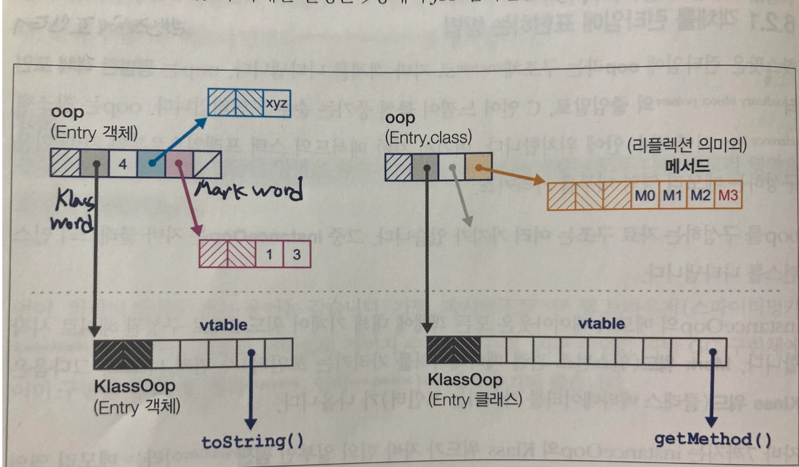
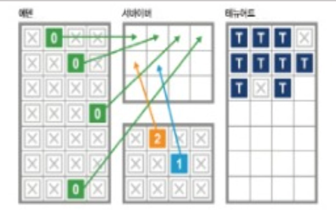

자바 환경에서는 여러 상징적이고 중요한 특징들이 있는데, 그 중 하나가 바로 가비지 컬렉션.

자바의 가비지 컬렉션의 핵심

- 시스템 내 모든 객체의 정확한 수명 주기를 이해해야 할 필요 없이, 런타임이 이를 대신 관리한다.
- 더 이상 필요하지 않은 객체를 자동으로 제거
- 회수된 메모리를 초기화된 후 재사용할 수 있다.
- 자바 언어 수준에서 컬렉터의 동작을 제어할 방법을 의도적으로 제공하지 않았다.

<aside>

System.gc() 메서드가 존재하기는 하지만, 실제로 사용하기에는 거의 쓸모가 없다.

</aside>

모든 가비지 컬렉션 구현은 다음 두 가지 기본 규칙을 준수하려고 노력한다.

- 활성 객체는 절대 수집되지 않아야 한다.
- 알고리즘은 모든 가비지를 수집해야 한다.

가비지 컬렉션 알고리즘이 일부 가비지를 지속적으로 수집하지 못한다면, 최악의 경우 시간이 지나면서 애플리케이션이 메모리를 모두 소진하고 결국 충돌하게 된다. 이는 심각한 문제이지만, 활성 객체를 잘못 수집하여 메모리 손상을 유발하는 것보다는 상대적으로 나은 상황이다.

## 4.1 마크 앤 스윕 소개

기본적으로 마크 앤 스윕 알고리즘은 할당된 객체 리스트를 사용하여, 회수되지 않은 객체들의 포인터를 유지하는 방식으로 동작한다.

1. 할당된 리스트를 순회하며 마크 비트(mark bit)를 초기화한다.
2. 힙으로의 모든 포인터를 시작점으로 하여 접근 가능한 모든 객체를 찾는다.
3. 도달한 각 객체에 마크 비트를 설정한다.
4. 할당된 리스트를 순회하며, 마크 비트가 설정되지 않은 객체에 대해 다음 작업을 수행한다.
    1. 힙에서 해당 객체의 메모리를 회수하여 자유 리스트(free list)에 다시 추가한다.
    2. 객체를 할당된 리스트에서 제거한다.

활성 객체

- 보통 깊이 우선 탐색(dfs)
- 활성 객체 그래프
- 반대로, 접근할 수 없는 객체는 종종 죽은 객체라고 한다.

## 4.2 가비지 컬렉션 용어집

- STW
    - 가비지 컬렉션 사이클이 진행되는 동안 모든 애플리케이션 스레드를 멈춰야 한다. 애플리케이션 코드가 가비지 컬렉션 스레드가 보는 힙 상태를 무효화하지 않도록 방지하는 역할.
- 동시성
    - 가비지 컬렉션 스레드가 애플리케이션 스레드가 실행되는 동안에도 동작할 수 있다.
      자바 9부터 핫스팟의 기본 가비지 컬렉터는 G1이며, 일부 동시성 측면을 가지고 있다.
- 병렬
    - 가비지 컬렉션 작업을 여러 스레드와 여러 코어를 사용해 실행
- 정확성
    - 정확한 가비지 컬렉션 방식에서는 힙 상태에 대한 타입 정보를 충분히 가지고 있어, 단일 사이클에서 모든 가비지를 수집할 수 있다.
- 보수성
    - 보수적인 방식은 정확한 방식과 달리 타입 정보를 충분히 제공하지 않는다. 그 결과, 보수적인 방식은 자원을 낭비하는 경우가 많고, 표현하려는 타입 시스템을 완벽히 이해하지 못해 일반적으로 효율성이 낮다.
- 이동
    - 이동형 컬렉터에서는 객체가 메모리 내에서 재배치될 수 있다. 즉, 객체가 고정된 주소를 갖지 않음을 의미한다. 자바와 달리 원시 포인터에 대한 직접 다룰 수 있는 환경에서는 이동형 컬렉터를 적용하기 어렵다.
- 압축
    - 가비지 컬렉션 사이클이 끝날 때, 할당된 메모리(생존 객체)는 단일 연속 영역에 배치되고, 새로운 객체를 기록할 수 있는 빈 공간의 시작 지점을 가리키는 포인터가 존재한다. 압축 컬렉터는 메모리 단편화를 방지한다.
- 대피
    - 가비지 컬렉션 사이클이 끝날 때, 수집된 영역은 완전히 비워지고, 모든 활성 객체가 다른 메모리 영역으로 이동(대피) 된다. 우수한 대피형 컬렉터는 메모리 단편화를 방지한다.

동시성이라는 용어는 이진 상태가 아니라 슬라이딩 스케일 개념으로 이해하는 것이 가장 좋다. 사용 중인 컬렉터에 따라 컬렉션 작업 중 일부 또는 전부가 애플리케이션 스레드와 동시적으로 수행될 수 있다.

## 4.3 핫스팟 런타임 소개

자바에는 두 가지 종류의 값만 있다.

- 기본 타입(byte, int 등)
- 객체 참조

자바는 일반적인 주소 역참조 매커니즘을 제공하지 않는다.

대신 자바는 오직 오프셋 연산자(. 연산자)를 사용하여 객체 참조에서 필드에 접근하거나 메서드를 호출할 수 있다.

또한 자바의 메서드 호출은 항상 값 복사 방식으로 이루어진다는 점을 기억해야 한다.

객체 참조의 경우, 이는 힙에 있는 객체의 주소가 복사된다는 것을 의미한다.

### 4.3.1 런타임에서 객체 표현

핫스팟은 런타임에 자바 객체를 oop(ordinary object pointer)라는 구조를 통해 표현한다. 이 oop는 C 언어에서 사용하는 진정한 포인터의 역할을 한다. 이러한 포인터는 참조 타입의 로컬 변수에 저장될 수 있으며, 자바 메서드의 스택 프레임에서 자바 힙의 메모리 영역으로 연결된다.

핫스팟은 사용자 공간 코드에서 힙 크기를 관리한다.(자바 힙을 관리할 때 시스템 콜을 사용하지 않는다.) 따라서, 간단한 관찰만으로 가비지 컬렉션 하위 시스템이 특정 문제를 유발하는지 확인할 수 있다.

- oop 데이터 구조 종류
    - instanceOop
        - 자바 클래스의 인스턴스를 표현하는 oop
    - arrayOop
        - 배열을 표현하는 oop

Entry 객체와 Entry.class 객체(getClass() 메서드를 통해 얻은 객체)가 있다.

이 두 자바 객체 모두 `klass`를 가지며, 이는 점선 아래 표시되어 있다.

기본적으로 `klass`는 클래스에 대한 가상함수 테이블(vtable)을 포함하고 있으며, 반면에 `Class` 객체는 리플렉션 호출에 사용되는 메서드 객체 배열을 포함한다.

- 압축 oop
    - oop는 일반적으로 머신 워드 크기를 따른다. 상당한 메모리를 낭비할 가능성이 있다. 이를 완화하기 위해 핫스팟은 압축 oop라는 기술을 제공한다.
    - 사용
        - `-XX:+UseCompressedOops

### 4.3.2 가비지 컬렉션 루트

가비지 컬렉션 루트는 메모리의 앵커 포인트다.

이는 특정 메모리 풀 외부에서 시작하여 해당 메모리 풀 내부를 가리키는 외부 포인터를 의미한다. 반면, 메모리 풀 내부에서 시작하여 같은 메모리 풀 내의 다른 위치를 가리키는 포인터는 내부 포인터로 간주된다.

## 4.4 할당과 수명 주기

자바 애플리케이션의 가비지 컬렉션 동작을 결정하는 두 가지 주요 요인

- 할당 속도
    - 일정 시간 동안 새로 생성된 객체가 사용하는 메모리의 양
- 객체의 수명 주기
    - 측정하거나 추정하기 훨씬 어렵다. 할당 속도보다 훨씬 더 근본적인 요소

<aside>

가비지 컬렉션은 메모리 회수와 재사용으로도 생각할 수 있다. 객체의 수명이 짧기 때문에 동일한 물리적 메모리를 반복적으로 사용할 수 있다는 점이 가비지 컬렉션 기술의 핵심 요소이다.

</aside>

## 4.5 약한 세대 가설

자바 가상 머신의 메모리 관리의 중요한 부분 중 하나는 소프트웨어 시스템의 런타임에서 관찰되는 약한 세대 가설을 기반으로 한다.

- 객체의 수명 분포는 이중 분포를 나타낸다.
    - 대부분의 객체는 수명이 매우 짧은 반면
    - 일부 객체는 훨씬 더 긴 수명을 가지는 경향

가비지 컬렉션 힙은 짧은 수명을 가진 객체를 쉽고 빠르게 수집할 수 있도록 구조화되어야 하며, 긴 수명을 가진 객체는 짧은 수명의 객체와 분리되어야 한다.

→ 이는 힙이 두 개의 별도 영역, 짧은 수명의 영역과 긴 수명의 영역을 가져야 하며, 각각 짧은 세대 컬렉션과 전체 컬렉션에서 별도로 수집되어야 한다는 것을 의미한다.

## 4.6 핫스팟의 프로덕션 가비지 컬렉션 기술

할당 성능을 개선하기 위해 사용되는 핵심 기술

### 4.6.1 스레드-로컬 할당

- 에덴: 힙의 영역 중 대부분의 객체가 생성되는 영역, 수명이 매우 짧은 객체가 존재하는 곳
    - 약한 세대 가설에 따르면, 이 영역에서 많은 객체를 추가 비용 없이 수집할 수 있다.
- 핫스팟은 에덴을 여러 개의 버퍼로 분할하고, 각 애플리케이션 스레드에 독립적인 에덴 영역을 할당하여 새 객체를 생성하도록 한다.
    - 각 스레드가 자신에게 할당된 버퍼에서만 작업하므로, 다른 스레드가 동일한 버퍼에서 할당 작업을 수행하는 것을 걱정할 필요가 없다.
    - 이러한 영역을 `스레드-로컬 할당 버퍼`라고 한다.

<aside>

핫스팟은 애플리케이션 스레드에 할당하는 스레드-로컬 할당 버퍼의 크기를 동적으로 조정한다. 따라서 특정 스레드가 메모리를 빠르게 소모하는 경우, 해당 스레드에 더 큰 TLAB을 할당하여 오버헤드를 줄일 수 있다.

</aside>

- 스레드가 스레드-로컬 할당 버퍼를 독점적으로 제어할 수 있다는 것은, 자바 가상 머신 스레드에서 객체 할당이 O(1) 시간 복잡도로 이루어진다는 것읗 의미한다.
- 스레드가 현재 스레드-로컬 할당 버퍼를 모두 채우면, jvm은 에덴의 새로운 영역을 할당하여 제공한다.

## 4.6.2 반구형 컬렉션

- 대피형 컬렉터의 사례 중 하나
- 같은 크기의 두 개 공간을 사용한다.
- 한 공간을 실제로 오래 지속되지 않는 객체의 임시 보관소로 활용
    - 짧은 수명의 객체가 영구 세대에 혼입되는 것을 방지하고
    - 전체 가비지 컬렉션의 빈도를 줄임

이 공간의 속성

- 컬렉터가 현재 활성화된 반구를 수집할 때, 객체는 압축 방식으로 다른 반구로 이동되며, 수집된 반구는 재사용을 위해 비워진다.
- 공간의 절반은 항상 완전히 비워진 상태로 유지된다.

핫스팟 젊은 힙의 반구형 영역은 서바이버 공간이라고 한다.

### 4.6.3 클래식 핫스팟 힙

이제 모든 내용을 종합하여 핫스팟 힙의 기본적인 특징을 설명한다.

- 각 객체의 ‘세대 카운트’(지금까지 생존한 가비지 컬렉션 수)를 추적
- 큰 객체를 제외하고, 새 객체는 ‘에덴’ 공간에 생성되며, 생존한 객체는 두 개의 서바이버 공간 중 하나로 이동된다.
- 메모리의 별도 영역(오래되었거나 영구한 세대)을 유지하여, 일정 기간 생존한 객체를 지정한다.

일정 횟수의 가비지 컬렉션을 생존한 객체가 영구 세대로 승격되는 과정을 보여준다.

각 영역이 연속적으로 구성된다.

## 4.7 병렬 컬렉터

자바 8 또는 이전 버전에서 자바 가상 머신의 기본 가비지 컬렉터는 병렬 컬렉터였다.

이 컬렉터들은 젊은 세대와 전체 컬렉션 모두에서 STW(Stop-the-World) 방식으로 동작하며, 처리량 최적화에 중점을 둔다.

- 병렬 가비지 컬렉션
    - 젊은 세대를 위한 가장 간단한 컬렉터
- ParNew
    - 병렬 가비지 컬렉터의 변형된 버전, 더 이상 사용되지 않는 동시 마크 스윕 컬렉터와 함께 사용되었다.
- ParallelOld
    - 영구 세대를 위한 병렬 컬렉터

### 4.7.1 젊은 병렬 컬렉션

- 스레드가 에덴에 객체를 할당하려고 시도했을 때 스레드-로컬 할당 버퍼에 충분한 공간이 없고, 자바 가상 머신이 해당 스레드에 새로운 스레드-로컬 할당 버퍼를 할당할 수 없는 경우에 발생한다. 이런 상황이 발생하면 자바 가상 머신은 모든 애플리케이션 스레드를 중지할 수 밖에 없다.
- 애플리케이션 스레드가 중지되면, 핫스팟은 젊은 세대를 확인하고, 가비지가 아닌 모든 객체를 식별.
- 가비지 컬렉션 루트를 시작점으로 병렬 마킹 스캔을 수행한다.

### 4.7.2 오래된 병렬 컬렉션

ParallelOld는 단일 연속 메모리 공간을 사용하는 압축형 컬렉터.

### 4.7.3 직렬 또는 SerialOld

### 4.7.4 병렬 컬렉터의 한계

- 병렬 컬렉터는 한 번에 세대 전체를 처리하려 설계
- 병렬 컬렉터는 완전히 STW 방식으로 작동한다.
- 오래된 세대의 수집 때문에 STW 시간이 훨씬 길어질 가능성이 있다.
    - ParallelOld 컬렉션의 주요 약점

## 4.8 할당의 역할

자바의 가비지 컬렉션은 보통 메모리 할당 요청 시, 필요한 메모리를 제공할 만큼 충분한 여유 메모리가 없을 때 발생한다. 따라서, GC cycle은 예측 가능한 주기로 실행되지 않고, 필요에 따라 실행된다.

→ 힙 메모리 공간 중 하나 이상이 거의 가득 차 객체를 더 이상 생성할 수 없게 될 때 가비지 컬렉션 사이클이 트리거된다.

시계열 라이브러리가 다루기 힘든 요소이다.

jvm은 모든 코어를 사용해 가비지 컬렉션을 수행하여 메모리를 회수한 뒤, 애플리케이션 스레드를 다시 시작한다.

할당 속도가 높아질수록 가비지 컬렉션은 더 자주 발생하며, 할당 속도가 지나치게 높을 경우 객체가 조기 승격되는 상황이 발생한다.

이 현상을 ‘조기 승격’이라고 하며, 이는 가비지 컬렉션의 가장 중요한 간접적 여향 중 하나로, 많은 튜닝의 시작점이 된다.